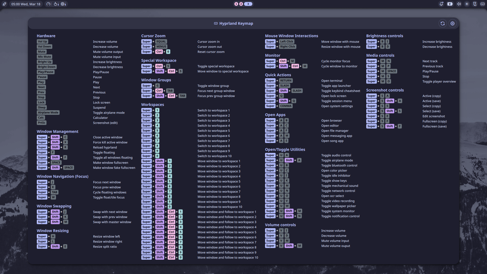

# Keybind Cheatsheet for Noctalia

Universal keyboard shortcuts cheatsheet plugin for Noctalia that displays your Hyprland keybindings.



## Features
- **Configurable paths** - set your keybinds config file location in settings
- **Smart key formatting** - XF86 keys display as readable names (Vol Up, Bright Down, etc.)
- **Color-coded modifier keys** (Super, Ctrl, Shift, Alt)
- **Flexible column layout** (1-4 columns)
- **Auto-height** - adjusts to content automatically
- **IPC support** - global hotkey toggle

## Supported Compositor

| Default Config (default) | Format |
|--------------------------|--------|
| `~/.config/hypr/hyprland.conf` | Hyprland config format |

## Installation

```bash
cp -r keybind-cheatsheet ~/.config/noctalia/plugins/
```

## Usage

### Bar Widget

Add the plugin to your bar configuration in Noctalia settings. Click the keyboard icon to open the cheatsheet.

### Global Hotkey

Add to your Hyprland config:

```bash
bind = $mod, F1, exec, qs -c noctalia-shell ipc call plugin:keybind-cheatsheet toggle
```

You can specify your custom Super key variable (e.g., $mainMod) in the plugin settings.

## Config Format

The plugin parses your keybinds config file.

**Keybind format:**

```bash
# 1. APPLICATIONS
bind = $mainMod, T, exec, alacritty #"Terminal"
bind = $mainMod, B, exec, firefox #"Browser"

# 2. WINDOW MANAGEMENT
bind = $mainMod, Q, killactive, #"Close window"
bind = $mainMod, F, fullscreen, #"Toggle fullscreen"

# 3. WORKSPACES
bind = $mainMod, 1, workspace, 1 #"Workspace 1"
bind = $mainMod SHIFT, 1, movetoworkspace, 1 #"Move to workspace 1"
```

**Requirements:**

- Categories: `# N. CATEGORY NAME` (where N is a number)
- Descriptions: `#"description"` at end of bind line
- Modifiers: `$mod`, `SHIFT`, `CTRL`, `ALT`

## Special Key Formatting

XF86 and other special keys are automatically formatted:

| Raw Key | Display |
|---------|---------|
| `XF86AudioRaiseVolume` | Vol Up |
| `XF86AudioLowerVolume` | Vol Down |
| `XF86AudioMute` | Mute |
| `XF86MonBrightnessUp` | Bright Up |
| `XF86MonBrightnessDown` | Bright Down |
| `Print` | PrtSc |
| `Prior` / `Next` | PgUp / PgDn |

## Settings

Access settings via the gear icon in the panel header:

- **Window width** - 400-3000px
- **Height** - Auto or manual (300-2000px)
- **Columns** - 1-4 columns
- **Config paths** - Custom path for Hyprland keybinds config (default: `~/.config/hypr/hyprland.conf`)
- **Refresh** - Force reload keybindings

## Troubleshooting

### "Loading..." stays forever

1. Check compositor is detected: look for logs with `[KeybindCheatsheet]`
2. Verify config file exists at the configured path
3. Ensure keybinds have proper format with descriptions

### No categories found

Categories must start with `# 1.`, `# 2.`, etc.

### Keybinds not showing

Verify the config path in settings points to your keybinds file.

## Requirements

- Noctalia Shell 4.1.0+
- Hyprland compositor
